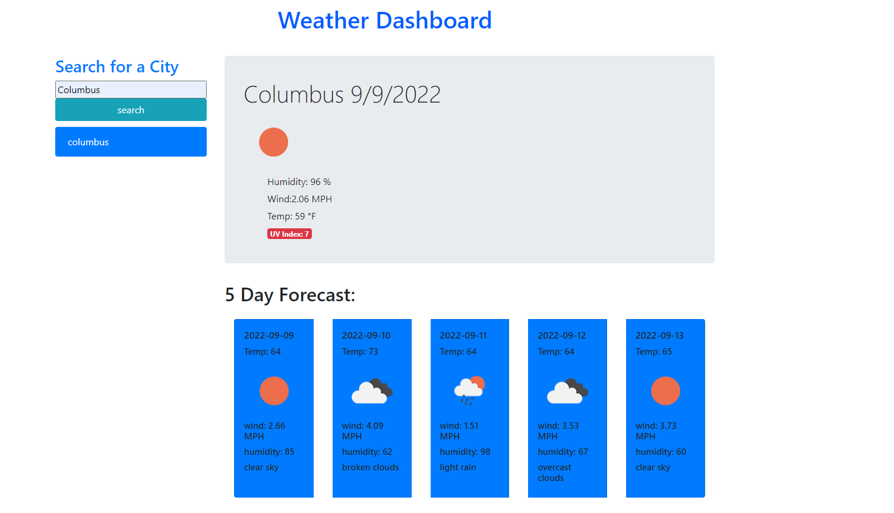
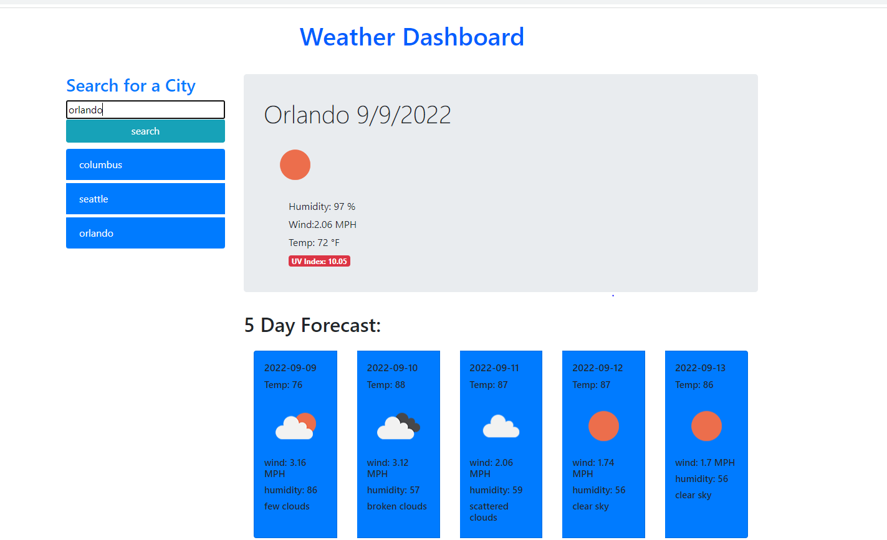

# weather-dashboard
This a weather dashboard API application that can access weather information

## I added some of the following items:  
 

- Created html elements
- Created CSS styles for application
- Created main function to query API data
- Created Render function
- Created for loops to loop through the data
- Created html elements dynamically 
- Created button eventlisteners
- Created Display functions for buttons

## Sreenshots of the web page ##

## Links ##

- GitHub Repository
(https://github.com/noviceprogrammeroh/weather-dashboard)

- GitHub Pages
(https://noviceprogrammeroh.github.io/weather-dashboard/)